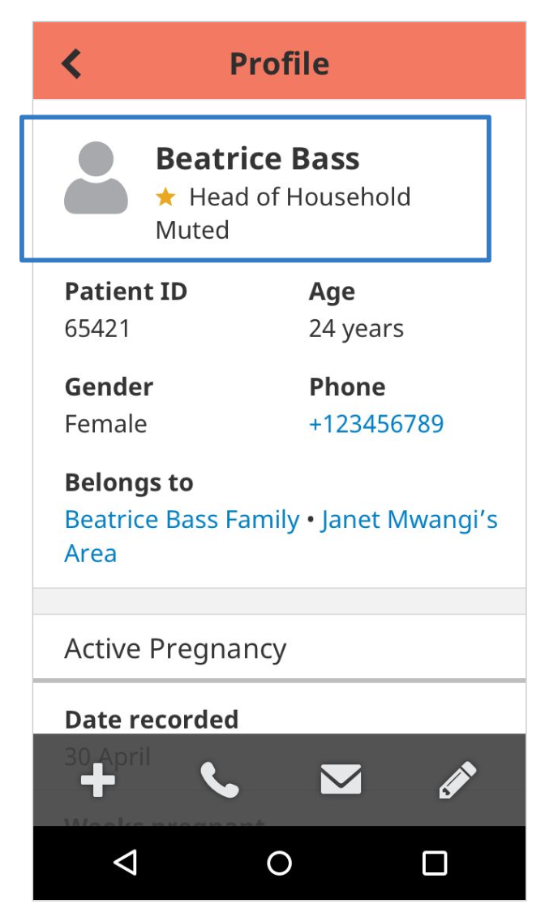

# 🟠 Changes to muted person profiles

<figure><figcaption>
Muted person profile
</figcaption></figure>

The UI of muted person profiles updates to make the muted status clear and easily recognizable.

* The icon turns grey
*   A status of “Muted” displays on the second line

    below the person’s name

    Any actions that were previously available on the family remain available on the profile.
* Instead of the “Mute” form, there is now “Unmute”
* If an action is begun on a muted person, there will be a warning message saying “This person is currently muted. Are you sure you want to proceed?”
